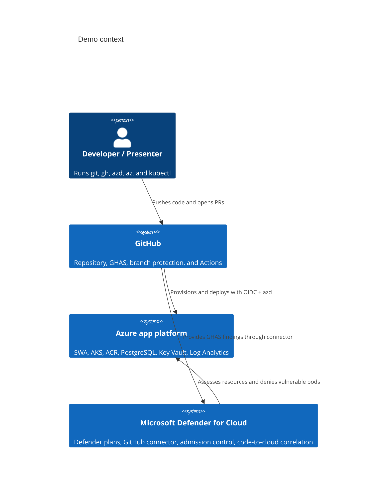

# GHAS + Defender for Cloud Demo

> End-to-end demonstration of GitHub Advanced Security shift-left controls and Microsoft Defender for Cloud runtime/admission controls on Azure.

[](https://github.com/JoranBergfeld/ghas-defender-example/actions/workflows/infra.yml)
[](https://github.com/JoranBergfeld/ghas-defender-example/actions/workflows/backend-ci.yml)
[](https://github.com/JoranBergfeld/ghas-defender-example/actions/workflows/frontend-ci.yml)
[](LICENSE)

## What this demonstrates

This repository is a self-contained demo for engineers and architects evaluating GitHub Advanced Security (GHAS) with Microsoft Defender for Cloud. It shows four money moments: secret scanning push protection blocks a token before it reaches GitHub, CodeQL blocks a SQL injection pull request, Defender for Containers denies a vulnerable AKS deployment after the image reaches ACR, and Defender for Cloud correlates GHAS findings with the running AKS workload. The goal is a repeatable `azd up` demo, not a production landing zone.

## Architecture



See [`docs/ARCHITECTURE.md`](docs/ARCHITECTURE.md) for the full context diagram, container diagram, component table, request path, security path, identity model, and failure modes.

## Prerequisites

You need:

- Azure subscription where you can act as **Owner**. The Bicep deployment enables subscription-scoped Defender plans.
- GitHub repository admin access for `JoranBergfeld/ghas-defender-example` or your fork.
- GitHub Advanced Security available for the repository.
- Local tools:
  - `git`
  - `gh`
  - `az`
  - `azd` 1.10 or newer
  - `kubectl`
  - Docker
  - Java 21
  - Node.js 20
- Ability to complete one browser-based OAuth consent for the Defender for Cloud GitHub connector.

Check tool access:

```bash
gh auth status
az version --query '"azure-cli " + ."azure-cli"' -o tsv
azd version
kubectl version --client=true
java -version
node --version
docker --version
```

## Bootstrap

### 1. Clone the repository

```bash
git clone https://github.com/JoranBergfeld/ghas-defender-example.git
cd ghas-defender-example
```

Expected:

```text
Cloning into 'ghas-defender-example'...
```

### 2. Sign in to Azure and azd

```bash
az login
azd auth login
az account show --query '{subscription:id, tenant:tenantId}' -o table
```

Expected:

```text
Subscription                          Tenant
------------------------------------  ------------------------------------
<subscription-id>                     <tenant-id>
```

### 3. Create the azd environment

```bash
azd env new demo
azd env set AZURE_LOCATION westeurope
```

Expected:

```text
Environment 'demo' created.
```

### 4. Provision and deploy

```bash
azd up
```

Expected high-level output:

```text
Provisioning Azure resources (azd provision)
Deploying service backend
Deploying service frontend
SUCCESS: Your application was provisioned and deployed to Azure in <duration>.
```

The first deployment creates the resource group, virtual network, PostgreSQL, Key Vault, ACR, AKS, Static Web Apps, Log Analytics, Defender plans, managed identities, and GitHub connector resource. The post-provision hook gets AKS credentials, creates the backend ServiceAccount, runs schema setup, waits for the ingress IP, and sets `VITE_API_BASE_URL`.

### 5. Complete one-time GitHub and Defender setup

In the Azure portal, open **Microsoft Defender for Cloud > Environment settings > GitHub connectors** and complete the OAuth authorization for the repository.

Then run:

```bash
./scripts/setup-repo.sh
```

Expected:

```text
Setting repository variables: AZURE_CLIENT_ID, AZURE_TENANT_ID, AZURE_SUBSCRIPTION_ID
Enabling secret scanning and push protection
Enabling Dependabot alerts and security updates
Applying branch protection to main, secure, vulnerable
Repository setup complete
```

### 6. Trigger the demo branches

For a clean successful deployment, update the harmless backend trigger file so the path-filtered backend workflow runs:

```bash
git fetch origin secure
git switch secure
date -u +%Y-%m-%dT%H:%M:%SZ > src/backend/.demo-trigger
git add src/backend/.demo-trigger
git commit -m "demo: trigger secure deployment"
git push origin secure
```

For the failure-path branch, update the same backend trigger file on `vulnerable`:

```bash
git fetch origin vulnerable
git switch vulnerable
date -u +%Y-%m-%dT%H:%M:%SZ > src/backend/.demo-trigger
git add src/backend/.demo-trigger
git commit -m "demo: trigger vulnerable deployment"
git push origin vulnerable
```

Expected: `secure` deploys successfully. `vulnerable` produces security findings and, for the backend container scenario, is denied by the Defender admission policy.

## Try the demo

Follow [`docs/DEMO.md`](docs/DEMO.md) for the presenter runbook:

1. Secret pushed, blocked by push protection.
2. PR with SQL injection, blocked by CodeQL required check.
3. Vulnerable container reaches ACR, then Defender denies the AKS pod.
4. Code-to-cloud correlation in Defender for Cloud DevOps Security.

## Repository tour

| Path | Contents |
| --- | --- |
| [`azure.yaml`](azure.yaml) | Azure Developer CLI services and hooks for backend and frontend deployment. |
| [`infra/`](infra/) | Subscription-scoped Bicep entry point and modules for network, identities, ACR, AKS, PostgreSQL, SWA, Key Vault, Log Analytics, and Defender. |
| [`src/backend/`](src/backend/) | Java 21 Spring Boot API, Dockerfile, and Kubernetes manifests. |
| [`src/frontend/`](src/frontend/) | React 18 + TypeScript + Vite frontend for Static Web Apps. |
| [`.github/workflows/`](.github/workflows/) | Infra, backend, and frontend CI/CD workflows with CodeQL and OIDC-based Azure login. |
| [`scripts/`](scripts/) | azd hooks, repository setup, and seeded vulnerability inventory. |
| [`docs/ARCHITECTURE.md`](docs/ARCHITECTURE.md) | Architecture diagrams, component table, request path, security path, identity model, and failure modes. |
| [`docs/DEMO.md`](docs/DEMO.md) | Four-scenario live demo runbook. |
| [`docs/superpowers/specs/2026-06-01-ghas-defender-demo-design.md`](docs/superpowers/specs/2026-06-01-ghas-defender-demo-design.md) | Approved source-of-truth design and scope boundaries. |

## Cost

Estimated cost if the demo runs 24x7 for a full month in `westeurope`: **about US$320/month** before taxes, discounts, reservations, or regional pricing changes.

| Resource | Demo sizing assumption | Approximate monthly cost |
| --- | --- | --- |
| AKS node pool | 2 × `Standard_D2as_v5` nodes | US$140 |
| Azure Container Registry | Premium | US$50 |
| Azure Database for PostgreSQL Flexible Server | Burstable dev SKU with small storage | US$35 |
| Static Web Apps | Standard | US$9 |
| Log Analytics | Light demo ingestion | US$10 |
| Defender for Containers / CSPM / related plans | Small AKS + registry + subscription posture | US$75 |
| Key Vault, private endpoints, public IP, bandwidth | Low demo usage | US$5 |

Tear down the environment when you are finished:

```bash
azd down --purge
```

Expected:

```text
SUCCESS: Your application was removed from Azure in <duration>.
```

## Troubleshooting

### Defender plans or admission policy are not active yet

Fresh Defender enablement can take 10–45 minutes to propagate.

```bash
az security pricing list -o table
kubectl get pods -n kube-system | grep -E 'defender|gatekeeper|azure-policy'
```

Expected: Defender plans show enabled pricing tiers, and AKS has Azure Policy/Gatekeeper and Defender-related pods.

### Defender for Cloud GitHub connector shows no repository data

The connector resource can be deployed by Bicep, but the GitHub OAuth consent is a one-time human step.

```bash
az graph query -q "resources | where type =~ 'microsoft.security/securityconnectors' | project name, location, resourceGroup" -o table
```

Expected: a GitHub security connector exists. If the portal still shows authorization pending, complete the OAuth flow in Defender for Cloud and wait for ingestion.

### PostgreSQL private DNS resolution fails

Backend pods must resolve PostgreSQL through the private DNS zone linked to the virtual network.

```bash
RG="$(azd env get-value AZURE_RESOURCE_GROUP)"
az network private-dns link vnet list --resource-group "$RG" --zone-name privatelink.postgres.database.azure.com -o table
kubectl logs deployment/backend -n app --tail=100
```

Expected: the private DNS zone has a virtual network link, and backend logs do not show PostgreSQL hostname resolution errors.

### NGINX ingress IP is missing or stale

The frontend uses `VITE_API_BASE_URL`, which is captured after the ingress LoadBalancer receives an IP.

```bash
kubectl get service -n app
azd env get-value VITE_API_BASE_URL
```

Expected: the ingress service has an external IP and `VITE_API_BASE_URL` points to `https://<ip>.nip.io`. If it is empty or stale, rerun the post-provision hook or `azd provision`, then redeploy the frontend.

### azd environment values changed after re-provisioning

Re-provisioning can change generated names, ingress IPs, or outputs.

```bash
azd env get-values
azd deploy backend --no-prompt
azd deploy frontend --no-prompt
```

Expected: environment values include the current resource group, AKS name, ACR endpoint, SWA name, and `VITE_API_BASE_URL` before deployment starts.

### GitHub Actions cannot authenticate to Azure

The workflows use OIDC and repository variables, not Azure client secrets.

```bash
gh variable list
gh api repos/JoranBergfeld/ghas-defender-example/actions/variables --jq '.variables[].name'
```

Expected variables include `AZURE_CLIENT_ID`, `AZURE_TENANT_ID`, and `AZURE_SUBSCRIPTION_ID`. If they are missing, rerun `./scripts/setup-repo.sh` after `azd up`.

## License and contributing

This sample is licensed under the terms in [`LICENSE`](LICENSE). Contributions should preserve the three-branch demo model, keep seeded vulnerabilities isolated to `vulnerable`, update [`scripts/seed-vulnerabilities.md`](scripts/seed-vulnerabilities.md) when a seed changes, and follow the approved design in [`docs/superpowers/specs/2026-06-01-ghas-defender-demo-design.md`](docs/superpowers/specs/2026-06-01-ghas-defender-demo-design.md).

## Acknowledgements

Built to demonstrate the joint value of GitHub Advanced Security, Microsoft Defender for Cloud, Azure Developer CLI, Azure Kubernetes Service, Azure Static Web Apps, Azure Container Registry, and Azure Database for PostgreSQL.
