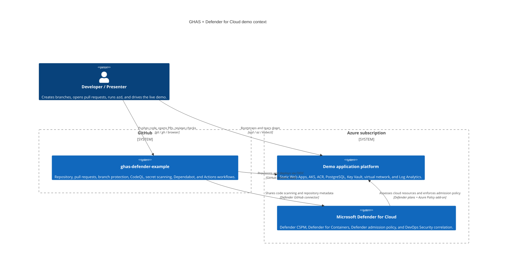
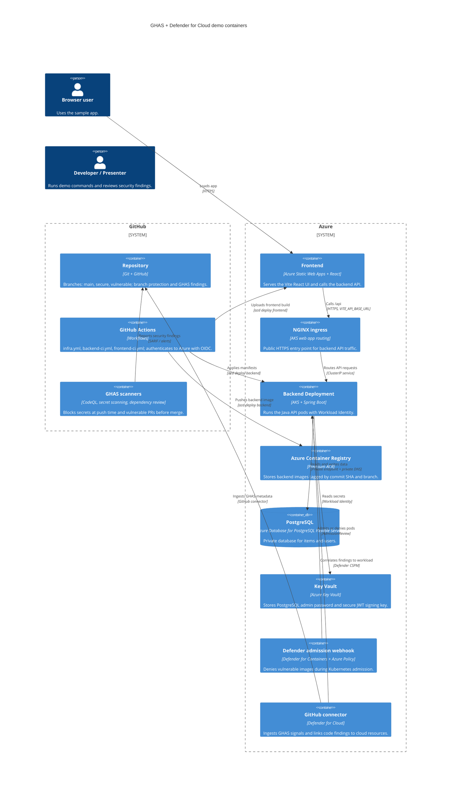

# Architecture

This repository demonstrates how GitHub Advanced Security (GHAS) and Microsoft Defender for Cloud work together across source code, CI, container registry, Kubernetes admission, and runtime posture. A React frontend is hosted on Azure Static Web Apps, a Spring Boot backend runs on AKS behind the built-in NGINX ingress, PostgreSQL and Key Vault stay private inside the virtual network, and Defender for Cloud correlates GHAS findings with the deployed AKS workload.

## Context diagram

## Container diagram

## Components

| Component | Source path | Responsibility | Key dependencies |
| --- | --- | --- | --- |
| Azure Developer CLI manifest | `azure.yaml` | Declares the `backend` and `frontend` services and the post-provision hook used by local and CI deployments. | `azd`, `scripts/azd-hooks/postprovision.sh`, `scripts/azd-hooks/postprovision.ps1` |
| Subscription entry point | `infra/main.bicep` | Creates the resource group, enables subscription-scoped Defender plans, and wires module outputs together. | Azure subscription Owner permissions, `infra/main.parameters.json` |
| Network module | `infra/modules/network.bicep` | Creates the demo virtual network, AKS subnet, PostgreSQL delegated subnet, private endpoint subnet, and private DNS zones. | Azure Virtual Network, private DNS |
| Identity module | `infra/modules/identity.bicep` | Creates user-assigned managed identities and federated credentials for GitHub Actions and AKS Workload Identity. | Microsoft Entra ID, GitHub OIDC subjects |
| ACR module | `infra/modules/acr.bicep` | Creates Premium Azure Container Registry and private endpoint. | Private endpoint subnet, role assignments |
| AKS module | `infra/modules/aks.bicep` | Creates AKS with Workload Identity, Azure Policy add-on, Defender profile, and NGINX web app routing. | ACR, Log Analytics, managed identities, network module |
| PostgreSQL module | `infra/modules/postgres.bicep` | Creates PostgreSQL Flexible Server with private access and the application database. | Delegated subnet, private DNS, Key Vault secret storage |
| Static Web Apps module | `infra/modules/swa.bicep` | Creates the Standard Static Web App for the React frontend. | `azd deploy frontend`, SWA deployment token fetched on demand |
| Key Vault module | `infra/modules/keyvault.bicep` | Creates RBAC-enabled Key Vault with private endpoint for application secrets. | Backend managed identity, developer principal |
| Log Analytics module | `infra/modules/loganalytics.bicep` | Creates the workspace used by AKS and Defender diagnostics. | AKS, Defender plans |
| Defender module | `infra/modules/defender.bicep` | Enables Defender CSPM, Containers, Key Vault, OSS DBs, Resource Manager, and creates the GitHub connector resource. | Subscription scope, GitHub OAuth completion in Azure portal |
| Backend API | `src/backend/` | Spring Boot API for `/api/items` and `/api/auth/login`; reads secrets through Workload Identity and stores data in PostgreSQL. | Java 21, Maven, Key Vault, PostgreSQL, AKS ServiceAccount |
| Backend Kubernetes manifests | `src/backend/k8s/` | Deployment, Service, and Ingress applied by `azd deploy backend`. | AKS, NGINX ingress, image tag substitution |
| Backend container image | `src/backend/Dockerfile` | Builds the Spring Boot container. The `secure` branch uses a hardened runtime image; `vulnerable` carries seeded container weaknesses. | ACR, Defender for Containers |
| Frontend app | `src/frontend/` | React 18 + TypeScript + Vite UI hosted by Static Web Apps. | `VITE_API_BASE_URL`, SWA, backend ingress |
| Infrastructure workflow | `.github/workflows/infra.yml` | Runs Bicep build/lint, what-if on PRs, CodeQL for IaC, and `azd provision` on demo branches. | GitHub OIDC, Azure CLI, azd |
| Backend workflow | `.github/workflows/backend-ci.yml` | Runs Maven tests, CodeQL Java, dependency review, and `azd deploy backend` on demo branches. | GitHub OIDC, ACR, AKS, Defender admission control |
| Frontend workflow | `.github/workflows/frontend-ci.yml` | Runs npm install, lint/test/build, CodeQL JavaScript/TypeScript, and `azd deploy frontend` on demo branches. | GitHub OIDC, Static Web Apps |
| Repository setup script | `scripts/setup-repo.sh` | Sets repository variables, enables GHAS features, and applies branch protection. | `gh`, repository admin access, azd environment outputs |
| Vulnerability inventory | `scripts/seed-vulnerabilities.md` | Documents every intentionally seeded vulnerability and the matching source labels. | `secure` and `vulnerable` branches |

## Request path

1. A browser loads the React app from Azure Static Web Apps.
2. The frontend reads `VITE_API_BASE_URL`, which the `postprovision` hook sets after the AKS NGINX ingress receives a public IP.
3. API calls go from the browser to the ingress hostname, then through the AKS LoadBalancer service to the backend Kubernetes Service.
4. The Service routes traffic to Spring Boot backend pods in the `app` namespace.
5. `/api/auth/login` is handled by the backend. On the `secure` branch, the JWT signing key is resolved from Key Vault by the pod's Workload Identity. On the `vulnerable` branch, the seeded hard-coded key exists only to trigger the security demo.
6. Authenticated `/api/items` requests send a bearer token to the backend. The backend validates the token and uses JPA/Hibernate to query PostgreSQL.
7. PostgreSQL traffic stays inside the virtual network through the delegated PostgreSQL subnet and the `privatelink.postgres.database.azure.com` private DNS zone.
8. PostgreSQL admin credentials are generated by Bicep and stored in Key Vault. They are never printed as deployment outputs or stored as GitHub secrets.

## Security path

1. A developer pushes code or opens a pull request.
2. GitHub secret scanning push protection blocks realistic secret patterns before they reach the remote repository.
3. CodeQL scans Java, JavaScript/TypeScript, and IaC according to `.github/codeql-config.yml`; required checks prevent vulnerable pull requests from merging into protected branches.
4. Dependabot and dependency review identify vulnerable dependencies before they become part of the protected branch history.
5. On demo branch pushes, GitHub Actions authenticates to Azure using OIDC and runs the same `azd provision` / `azd deploy` flow used locally.
6. The backend image is pushed to ACR. Defender for Containers scans the image after it lands in the registry.
7. During deployment, the Defender-managed admission policy runs through the AKS Azure Policy add-on. The `secure` image is admitted; the `vulnerable` image is denied before pods are created.
8. Defender for Cloud ingests GHAS findings through the GitHub connector and correlates repository alerts with cloud resources such as the AKS Deployment and container image.

## Identity model

| Identity | Type | Purpose | Roles and access |
| --- | --- | --- | --- |
| `id-gha-deployer` | User-assigned managed identity | Used by GitHub Actions through OIDC federated credentials for `main`, `secure`, `vulnerable`, and pull requests. | Contributor on the demo resource group, AcrPush on ACR, AKS user/admin roles for deployment, Static Web Apps Contributor, subscription Reader for what-if. |
| `id-backend` | User-assigned managed identity | Federated to the Kubernetes `backend` ServiceAccount through AKS Workload Identity. | Key Vault Secrets User on Key Vault and AcrPull on ACR, with ACR pull also covered by AKS attachment. |
| `id-defender-aks` | AKS system-assigned managed identity | Managed by Azure for the cluster and Defender integration. | Standard AKS-managed permissions plus Defender sensor/admission integrations configured by the AKS and Defender plans. |

No Azure client secrets are stored in GitHub. Repository variables contain only non-sensitive IDs: `AZURE_CLIENT_ID`, `AZURE_TENANT_ID`, and `AZURE_SUBSCRIPTION_ID`.

## Failure modes and recovery

| Branch or action | What blocks | What the presenter sees | Recovery |
| --- | --- | --- | --- |
| Pushing the fake token seed | GitHub secret scanning push protection | `GH013: Repository rule violations found` and a `GitHub Personal Access Token` location for `application-local.yml`. | Drop the disposable branch or remove the local seed commit. Do not bypass protection for a real secret. |
| Pull request with seeded SQL injection into `secure` | Required CodeQL status check | `backend-ci / codeql` fails and GitHub shows merge blocked by required checks. | Close the demo PR and delete the branch. Keep `secure` clean. |
| Pushing `secure` | No block expected | Workflows pass, frontend and backend deploy, and `kubectl rollout status` succeeds. | If deployment fails, inspect the workflow logs and run `azd env get-values` to confirm environment outputs. |
| Pushing `vulnerable` backend image | Defender for Containers admission policy | Backend workflow fails during rollout; Kubernetes events show `admission webhook` denied the image because of high-severity vulnerabilities. | Redeploy `secure` after the demo: update `src/backend/.demo-trigger` on `secure` so the path-filtered workflow runs, or run `azd deploy backend` from `secure`. |
| Defender GitHub connector not authorized | Defender DevOps ingestion cannot complete | Azure portal shows connector authorization pending or no repository findings. | Complete the GitHub OAuth handshake in Defender for Cloud, then wait for ingestion to refresh. |
| PostgreSQL private DNS missing or stale | Backend cannot connect to database | Backend logs show hostname resolution or connection timeout errors for PostgreSQL. | Re-run `azd provision`; verify the private DNS zone link and restart backend pods. |
| NGINX ingress IP not assigned yet | Frontend cannot call backend | `VITE_API_BASE_URL` is empty or points to an old IP. | Wait for the LoadBalancer IP, run the post-provision hook again, then redeploy the frontend. |

## Out of scope

This demo intentionally excludes custom domains, WAF, Front Door, autoscaling, production RBAC hardening, GitOps, image signing, budget automation, and multi-environment promotion. Those choices keep the live story focused on GHAS shift-left controls, Defender runtime/admission controls, and code-to-cloud correlation.
