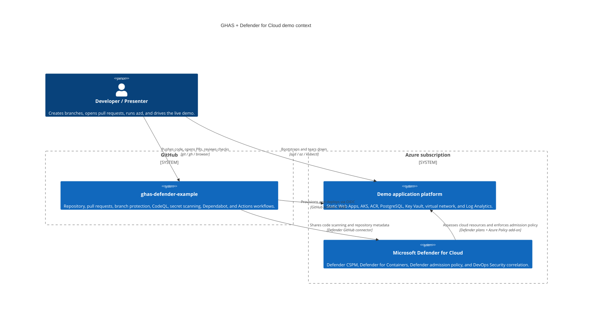
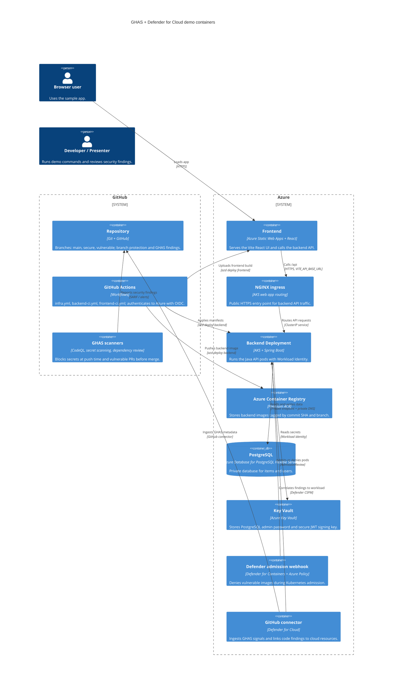
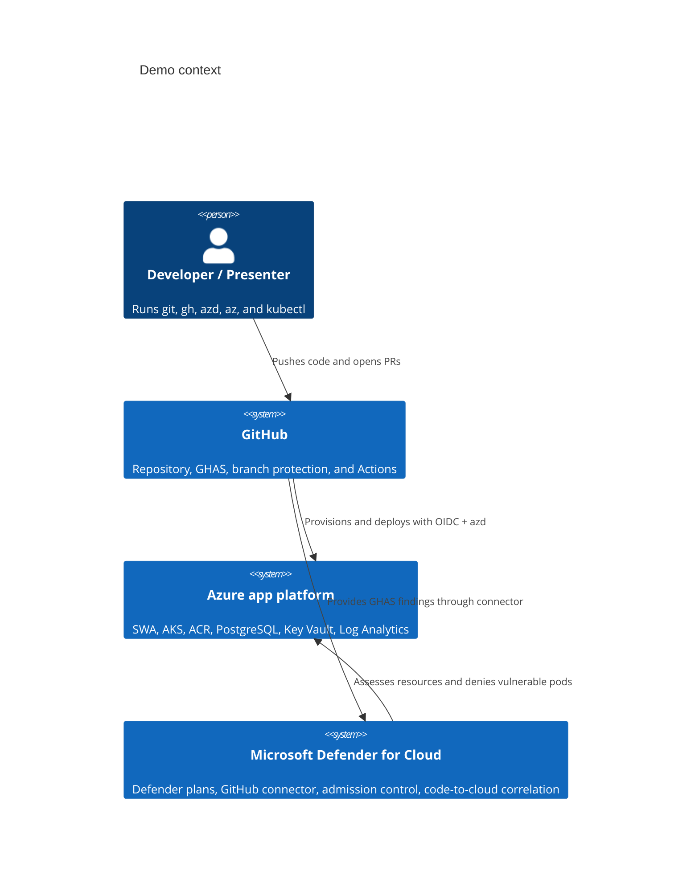

# Plan 8 — Demo Documentation Implementation Plan

> **For agentic workers:** REQUIRED SUB-SKILL: Use superpowers:subagent-driven-development (recommended) or superpowers:executing-plans to implement this plan task-by-task. Steps use checkbox (`- [ ]`) syntax for tracking.

**Goal:** Produce the final documentation set so a new presenter can bootstrap the GHAS + Microsoft Defender for Cloud demo, understand the architecture, and run all four demo scenarios without tribal knowledge.

**Architecture:** This is a documentation-only plan. It creates two reference documents (`docs/ARCHITECTURE.md`, `docs/DEMO.md`), rewrites `README.md` as the landing page, and removes stale `.gitkeep` files from populated superpowers directories. The docs describe existing Plans 1–7 artifacts and do not change application, infrastructure, workflow, or script behavior.

**Tech Stack:** Markdown, Mermaid C4-style diagrams, GitHub CLI (`gh`), Azure CLI (`az`), Azure Developer CLI (`azd`), `kubectl`, GitHub Advanced Security, Microsoft Defender for Cloud, AKS, ACR, Static Web Apps, PostgreSQL Flexible Server.

---

## Required context

Read these files before executing any task:

```bash
sed -n '1,260p' docs/superpowers/specs/2026-06-01-ghas-defender-demo-design.md
sed -n '261,520p' docs/superpowers/specs/2026-06-01-ghas-defender-demo-design.md
sed -n '1,220p' .github/copilot-instructions.md
```

Expected: the spec shows the four money moments in §1, the bootstrap flow and identities in §8, and the documentation scope in §9. The instructions confirm the three-branch model and that this repository is a demo, not a production template.

## File map

| Path | Action | Responsibility |
| --- | --- | --- |
| `docs/ARCHITECTURE.md` | Create | Reference architecture, Mermaid diagrams, component inventory, request/security paths, identity model, failure modes. |
| `docs/DEMO.md` | Create or replace | Presenter runbook for the four money moments, with exact commands, expected outputs, screenshot anchors, value narrative, and reset commands. |
| `README.md` | Create or replace | Polished landing page: what/why, badges, architecture pointer, prerequisites, bootstrap, demo link, repo tour, cost, troubleshooting, license/contributing. |
| `docs/superpowers/specs/.gitkeep` | Remove if present | No longer needed once the spec directory contains the design spec. |
| `docs/superpowers/plans/.gitkeep` | Remove if present | No longer needed once the plan directory contains implementation plans. |

## Cross-plan assumptions

- Plans 1–7 have already created `azure.yaml`, `infra/main.bicep`, `src/backend/`, `src/frontend/`, `.github/workflows/`, `scripts/setup-repo.sh`, and `scripts/seed-vulnerabilities.md`.
- `secure` contains clean demo code and deploys successfully.
- `vulnerable` contains intentionally seeded vulnerabilities catalogued in `scripts/seed-vulnerabilities.md`; do not remove or hide them.
- The repository uses three long-lived branches: `main`, `secure`, and `vulnerable`.
- GitHub Advanced Security features, branch protection, repository variables, and Defender for Cloud plans are enabled by earlier plans and `scripts/setup-repo.sh`.
- Azure resources are deployed through `azd`; docs must not introduce hand-written CI deployment steps that bypass `azd deploy`.
- This plan intentionally creates no screenshot image files. Screenshot anchors are HTML comments that describe what future screenshots must show.

---

### Task 1: Write the architecture reference

**Files:**
- Create: `docs/ARCHITECTURE.md`

- [ ] **Step 1: Confirm the working branch and current docs tree**

Run:

```bash
git --no-pager status --short --branch
find docs -maxdepth 3 -type f | sort
```

Expected output includes the current branch line and the approved design spec:

```text
## main...origin/main
docs/superpowers/specs/2026-06-01-ghas-defender-demo-design.md
```

If the branch line is not `main`, switch to `main` before editing documentation:

```bash
git switch main
git pull --ff-only origin main
```

Expected: `Already up to date.` or a fast-forward summary.

- [ ] **Step 2: Create `docs/ARCHITECTURE.md` with the full architecture content**

Run:

````bash
cat > docs/ARCHITECTURE.md <<'ARCHITECTURE_MD'
# Architecture

This repository demonstrates how GitHub Advanced Security (GHAS) and Microsoft Defender for Cloud work together across source code, CI, container registry, Kubernetes admission, and runtime posture. A React frontend is hosted on Azure Static Web Apps, a Spring Boot backend runs on AKS behind the built-in NGINX ingress, PostgreSQL and Key Vault stay private inside the virtual network, and Defender for Cloud correlates GHAS findings with the deployed AKS workload.

## Context diagram



## Container diagram



## Components

| Component | Source path | Responsibility | Key dependencies |
| --- | --- | --- | --- |
| Azure Developer CLI manifest | `azure.yaml` | Declares the `backend` and `frontend` services and the post-provision hook used by local and CI deployments. | `azd`, `scripts/azd-hooks/postprovision.sh`, `scripts/azd-hooks/postprovision.ps1` |
| Subscription entry point | `infra/main.bicep` | Creates the resource group, enables subscription-scoped Defender plans, and wires module outputs together. | Azure subscription Owner permissions, `infra/main.parameters.json` |
| Network module | `infra/modules/network.bicep` | Creates the demo virtual network, AKS subnet, PostgreSQL delegated subnet, private endpoint subnet, and private DNS zones. | Azure Virtual Network, private DNS |
| Identity module | `infra/modules/identity.bicep` | Creates user-assigned managed identities and federated credentials for GitHub Actions and AKS Workload Identity. | Microsoft Entra ID, GitHub OIDC subjects |
| ACR module | `infra/modules/acr.bicep` | Creates Premium Azure Container Registry and private endpoint. | Private endpoint subnet, role assignments |
| AKS module | `infra/modules/aks.bicep` | Creates AKS with Workload Identity, Azure Policy add-on, Defender profile, and NGINX web app routing. | ACR, Log Analytics, managed identities, network module |
| PostgreSQL module | `infra/modules/postgres.bicep` | Creates PostgreSQL Flexible Server with private access and the application database. | Delegated subnet, private DNS, Key Vault secret storage |
| Static Web Apps module | `infra/modules/swa.bicep` | Creates the Standard Static Web App for the React frontend. | `azd deploy frontend`, SWA deployment token fetched on demand |
| Key Vault module | `infra/modules/keyvault.bicep` | Creates RBAC-enabled Key Vault with private endpoint for application secrets. | Backend managed identity, developer principal |
| Log Analytics module | `infra/modules/loganalytics.bicep` | Creates the workspace used by AKS and Defender diagnostics. | AKS, Defender plans |
| Defender module | `infra/modules/defender.bicep` | Enables Defender CSPM, Containers, Key Vault, OSS DBs, Resource Manager, and creates the GitHub connector resource. | Subscription scope, GitHub OAuth completion in Azure portal |
| Backend API | `src/backend/` | Spring Boot API for `/api/items` and `/api/auth/login`; reads secrets through Workload Identity and stores data in PostgreSQL. | Java 21, Maven, Key Vault, PostgreSQL, AKS ServiceAccount |
| Backend Kubernetes manifests | `src/backend/k8s/` | Deployment, Service, and Ingress applied by `azd deploy backend`. | AKS, NGINX ingress, image tag substitution |
| Backend container image | `src/backend/Dockerfile` | Builds the Spring Boot container. The `secure` branch uses a hardened runtime image; `vulnerable` carries seeded container weaknesses. | ACR, Defender for Containers |
| Frontend app | `src/frontend/` | React 18 + TypeScript + Vite UI hosted by Static Web Apps. | `VITE_API_BASE_URL`, SWA, backend ingress |
| Infrastructure workflow | `.github/workflows/infra.yml` | Runs Bicep build/lint, what-if on PRs, CodeQL for IaC, and `azd provision` on demo branches. | GitHub OIDC, Azure CLI, azd |
| Backend workflow | `.github/workflows/backend-ci.yml` | Runs Maven tests, CodeQL Java, dependency review, and `azd deploy backend` on demo branches. | GitHub OIDC, ACR, AKS, Defender admission control |
| Frontend workflow | `.github/workflows/frontend-ci.yml` | Runs npm install, lint/test/build, CodeQL JavaScript/TypeScript, and `azd deploy frontend` on demo branches. | GitHub OIDC, Static Web Apps |
| Repository setup script | `scripts/setup-repo.sh` | Sets repository variables, enables GHAS features, and applies branch protection. | `gh`, repository admin access, azd environment outputs |
| Vulnerability inventory | `scripts/seed-vulnerabilities.md` | Documents every intentionally seeded vulnerability and the matching source labels. | `secure` and `vulnerable` branches |

## Request path

1. A browser loads the React app from Azure Static Web Apps.
2. The frontend reads `VITE_API_BASE_URL`, which the `postprovision` hook sets after the AKS NGINX ingress receives a public IP.
3. API calls go from the browser to the ingress hostname, then through the AKS LoadBalancer service to the backend Kubernetes Service.
4. The Service routes traffic to Spring Boot backend pods in the `app` namespace.
5. `/api/auth/login` is handled by the backend. On the `secure` branch, the JWT signing key is resolved from Key Vault by the pod's Workload Identity. On the `vulnerable` branch, the seeded hard-coded key exists only to trigger the security demo.
6. Authenticated `/api/items` requests send a bearer token to the backend. The backend validates the token and uses JPA/Hibernate to query PostgreSQL.
7. PostgreSQL traffic stays inside the virtual network through the delegated PostgreSQL subnet and the `privatelink.postgres.database.azure.com` private DNS zone.
8. PostgreSQL admin credentials are generated by Bicep and stored in Key Vault. They are never printed as deployment outputs or stored as GitHub secrets.

## Security path

1. A developer pushes code or opens a pull request.
2. GitHub secret scanning push protection blocks realistic secret patterns before they reach the remote repository.
3. CodeQL scans Java, JavaScript/TypeScript, and IaC according to `.github/codeql-config.yml`; required checks prevent vulnerable pull requests from merging into protected branches.
4. Dependabot and dependency review identify vulnerable dependencies before they become part of the protected branch history.
5. On demo branch pushes, GitHub Actions authenticates to Azure using OIDC and runs the same `azd provision` / `azd deploy` flow used locally.
6. The backend image is pushed to ACR. Defender for Containers scans the image after it lands in the registry.
7. During deployment, the Defender-managed admission policy runs through the AKS Azure Policy add-on. The `secure` image is admitted; the `vulnerable` image is denied before pods are created.
8. Defender for Cloud ingests GHAS findings through the GitHub connector and correlates repository alerts with cloud resources such as the AKS Deployment and container image.

## Identity model

| Identity | Type | Purpose | Roles and access |
| --- | --- | --- | --- |
| `id-gha-deployer` | User-assigned managed identity | Used by GitHub Actions through OIDC federated credentials for `main`, `secure`, `vulnerable`, and pull requests. | Contributor on the demo resource group, AcrPush on ACR, AKS user/admin roles for deployment, Static Web Apps Contributor, subscription Reader for what-if. |
| `id-backend` | User-assigned managed identity | Federated to the Kubernetes `backend` ServiceAccount through AKS Workload Identity. | Key Vault Secrets User on Key Vault and AcrPull on ACR, with ACR pull also covered by AKS attachment. |
| `id-defender-aks` | AKS system-assigned managed identity | Managed by Azure for the cluster and Defender integration. | Standard AKS-managed permissions plus Defender sensor/admission integrations configured by the AKS and Defender plans. |

No Azure client secrets are stored in GitHub. Repository variables contain only non-sensitive IDs: `AZURE_CLIENT_ID`, `AZURE_TENANT_ID`, and `AZURE_SUBSCRIPTION_ID`.

## Failure modes and recovery

| Branch or action | What blocks | What the presenter sees | Recovery |
| --- | --- | --- | --- |
| Pushing the fake token seed | GitHub secret scanning push protection | `GH013: Repository rule violations found` and a `GitHub Personal Access Token` location for `application-local.yml`. | Drop the disposable branch or remove the local seed commit. Do not bypass protection for a real secret. |
| Pull request with seeded SQL injection into `secure` | Required CodeQL status check | `backend-ci / codeql` fails and GitHub shows merge blocked by required checks. | Close the demo PR and delete the branch. Keep `secure` clean. |
| Pushing `secure` | No block expected | Workflows pass, frontend and backend deploy, and `kubectl rollout status` succeeds. | If deployment fails, inspect the workflow logs and run `azd env get-values` to confirm environment outputs. |
| Pushing `vulnerable` backend image | Defender for Containers admission policy | Backend workflow fails during rollout; Kubernetes events show `admission webhook` denied the image because of high-severity vulnerabilities. | Redeploy `secure` after the demo: update `src/backend/.demo-trigger` on `secure` so the path-filtered workflow runs, or run `azd deploy backend` from `secure`. |
| Defender GitHub connector not authorized | Defender DevOps ingestion cannot complete | Azure portal shows connector authorization pending or no repository findings. | Complete the GitHub OAuth handshake in Defender for Cloud, then wait for ingestion to refresh. |
| PostgreSQL private DNS missing or stale | Backend cannot connect to database | Backend logs show hostname resolution or connection timeout errors for PostgreSQL. | Re-run `azd provision`; verify the private DNS zone link and restart backend pods. |
| NGINX ingress IP not assigned yet | Frontend cannot call backend | `VITE_API_BASE_URL` is empty or points to an old IP. | Wait for the LoadBalancer IP, run the post-provision hook again, then redeploy the frontend. |

## Out of scope

This demo intentionally excludes custom domains, WAF, Front Door, autoscaling, production RBAC hardening, GitOps, image signing, budget automation, and multi-environment promotion. Those choices keep the live story focused on GHAS shift-left controls, Defender runtime/admission controls, and code-to-cloud correlation.
ARCHITECTURE_MD
````

- [ ] **Step 3: Verify the architecture document shape**

Run:

```bash
python3 - <<'PY'
from pathlib import Path
path = Path('docs/ARCHITECTURE.md')
text = path.read_text()
required = [
    '# Architecture',
    '```mermaid\nC4Context',
    '```mermaid\nC4Container',
    '## Components',
    '## Request path',
    '## Security path',
    '## Identity model',
    '## Failure modes and recovery',
    '`src/backend/`',
    '`src/frontend/`',
    '`infra/main.bicep`',
    '`scripts/setup-repo.sh`',
]
missing = [item for item in required if item not in text]
if missing:
    raise SystemExit('missing required architecture content: ' + ', '.join(missing))
print('architecture documentation verified')
PY
```

Expected:

```text
architecture documentation verified
```

- [ ] **Step 4: Verify Mermaid rendering in a Markdown renderer**

Run:

```bash
gh browse docs/ARCHITECTURE.md
```

Expected: a browser opens the repository page for `docs/ARCHITECTURE.md`. Both Mermaid diagrams render as diagrams, not as Mermaid syntax errors. The first diagram is the context view with Developer, GitHub, Azure, and Defender for Cloud. The second diagram is the container view with SWA, AKS, ACR, PostgreSQL, Key Vault, Defender admission webhook, and GitHub connector.

- [ ] **Step 5: Commit the architecture document**

Run:

```bash
git add docs/ARCHITECTURE.md
git commit -m $'docs: add architecture reference\n\nCo-authored-by: Copilot <223556219+Copilot@users.noreply.github.com>'
```

Expected: Git creates a commit whose subject is `docs: add architecture reference`.

---

### Task 2: Write `docs/DEMO.md` Scenario 1 — secret push protection

**Files:**
- Create: `docs/DEMO.md`

- [ ] **Step 1: Create the demo runbook with the overview and Scenario 1**

Run:

````bash
cat > docs/DEMO.md <<'DEMO_MD'
# Demo Runbook

This runbook drives the four GHAS + Microsoft Defender for Cloud money moments for `ghas-defender-example`. It assumes the infrastructure and repository settings from the README bootstrap have already been applied, including GHAS enablement, branch protection, Defender plans, the Defender for Cloud GitHub connector, and `azd` environment outputs.

## Presenter checklist

Run these checks before the first scenario:

```bash
git --no-pager status --short --branch
gh auth status
az account show --query '{subscription:id, tenant:tenantId}' -o table
azd env get-values | grep -E 'AZURE_(LOCATION|RESOURCE_GROUP|AKS_CLUSTER_NAME|CONTAINER_REGISTRY_ENDPOINT)|VITE_API_BASE_URL'
```

Expected:

```text
## main...origin/main
Logged in to github.com as <your-user>
Subscription                          Tenant
------------------------------------  ------------------------------------
<subscription-id>                     <tenant-id>
AZURE_LOCATION="westeurope"
AZURE_RESOURCE_GROUP="rg-ghas-defender-demo"
AZURE_AKS_CLUSTER_NAME="aks-demo"
AZURE_CONTAINER_REGISTRY_ENDPOINT="<acr-name>.azurecr.io"
VITE_API_BASE_URL="https://<ingress-ip>.nip.io"
```

Use `secure` for successful deployment moments and `vulnerable` for failure-path moments. Do not remove seeded vulnerabilities from `vulnerable`; they are the demo.

---

## Scenario 1 — Secret pushed, blocked by push protection

### What this demonstrates

GitHub secret scanning push protection blocks a realistic token pattern at `git push`, before the fake credential reaches the remote repository.

### Prerequisites

- Work from a disposable local branch created from `secure`.
- Secret scanning and push protection are enabled on the repository.
- The setup command below injects only seeded vulnerability #4, using the path and label documented in `scripts/seed-vulnerabilities.md`.
- The fake token is generated locally from string pieces so the documentation never stores a complete token-shaped value; never use a real credential.
- The working tree is clean before creating the disposable branch.

### Setup

Run:

```bash
git fetch origin secure
git switch -c demo/secret-push origin/secure
python3 - <<'PY'
from pathlib import Path
path = Path('src/backend/src/main/resources/application-local.yml')
path.parent.mkdir(parents=True, exist_ok=True)
existing = path.read_text() if path.exists() else ''
if 'SEEDED VULN #4' not in existing:
    fake_token = 'ghp_' + ('A' * 40)
    addition = '\n# SEEDED VULN #4 — see scripts/seed-vulnerabilities.md\ngithub-token: ' + fake_token + '\n'
    path.write_text(existing.rstrip() + addition)
print(f'wrote fake token seed to {path}')
PY
git status --short
grep -n 'ghp_' src/backend/src/main/resources/application-local.yml | sed -E 's/(ghp_)[A-Za-z0-9_]+/\1<redacted fake token>/'
```

Expected:

```text
branch 'demo/secret-push' set up to track 'origin/secure'.
Switched to a new branch 'demo/secret-push'
wrote fake token seed to src/backend/src/main/resources/application-local.yml
 M src/backend/src/main/resources/application-local.yml
12:github-token: ghp_<redacted fake token>
```

### The demo action

Run:

```bash
git add src/backend/src/main/resources/application-local.yml
git commit -m "demo: add fake token for push protection"
git push origin HEAD:refs/heads/demo/secret-push
```

### What you see

Expected push rejection excerpt:

```text
Enumerating objects: 1, done.
Counting objects: 100% (1/1), done.
Writing objects: 100% (1/1), done.
remote: error: GH013: Repository rule violations found for refs/heads/demo/secret-push.
remote:
remote: - GITHUB PUSH PROTECTION
remote:   —————————————————————————————————————————
remote:     Resolve the following secrets before pushing again.
remote:
remote:     GitHub Personal Access Token
remote:     locations:
remote:       - commit: <commit-sha>
remote:         path: src/backend/src/main/resources/application-local.yml:<line>
remote:
remote:     To push, remove secret from commit(s) or follow the provided GitHub URL to review the blocked secret.
To github.com:JoranBergfeld/ghas-defender-example.git
 ! [remote rejected] HEAD -> demo/secret-push (push declined due to repository rule violations)
error: failed to push some refs to 'github.com:JoranBergfeld/ghas-defender-example.git'
```

In the GitHub web UI, the push protection page names the detector as `GitHub Personal Access Token`, shows the repository and path, and offers remediation guidance. Do not allow the fake token unless the presenter intentionally wants to demonstrate the bypass review flow.

### Screenshot anchor

<!-- Screenshot: scenario-1-push-protection.png — should show the GitHub push protection rejection for `src/backend/src/main/resources/application-local.yml`, including the `GitHub Personal Access Token` detector and remediation guidance. -->

### Why this matters

This is the cleanest shift-left moment in the demo: a credential-shaped value is stopped before it becomes repository history. GHAS reduces blast radius by preventing secret exposure at the source, while the audit trail and remediation guidance give security teams a consistent workflow that does not depend on a later scan catching the issue.

### Reset

Run:

```bash
git switch main
git branch -D demo/secret-push
git ls-remote --heads origin demo/secret-push
```

Expected:

```text
Switched to branch 'main'
Deleted branch demo/secret-push (was <commit>).
```

`git ls-remote` should print no matching remote branch because push protection blocked the branch creation.
DEMO_MD
````

- [ ] **Step 2: Verify Scenario 1 required sections**

Run:

```bash
python3 - <<'PY'
from pathlib import Path
text = Path('docs/DEMO.md').read_text()
required = [
    '# Demo Runbook',
    '## Scenario 1 — Secret pushed, blocked by push protection',
    '### What this demonstrates',
    '### Prerequisites',
    '### Setup',
    '### The demo action',
    '### What you see',
    'scenario-1-push-protection.png',
    '### Why this matters',
    '### Reset',
    'GH013: Repository rule violations found',
]
missing = [item for item in required if item not in text]
if missing:
    raise SystemExit('missing Scenario 1 content: ' + ', '.join(missing))
print('scenario 1 documentation verified')
PY
```

Expected:

```text
scenario 1 documentation verified
```

- [ ] **Step 3: Walk the command flow without pushing if the presenter environment is not ready**

Run:

```bash
git fetch origin secure
git switch -c demo/secret-push-check origin/secure
python3 - <<'PY'
from pathlib import Path
path = Path('src/backend/src/main/resources/application-local.yml')
path.parent.mkdir(parents=True, exist_ok=True)
fake_token = 'ghp_' + ('A' * 40)
path.write_text('# SEEDED VULN #4 — see scripts/seed-vulnerabilities.md\ngithub-token: ' + fake_token + '\n')
print(f'wrote fake token seed to {path}')
PY
grep -n 'ghp_' src/backend/src/main/resources/application-local.yml | sed -E 's/(ghp_)[A-Za-z0-9_]+/\1<redacted fake token>/'
git reset --hard origin/secure
git clean -fd src/backend/src/main/resources >/dev/null
git switch main
git branch -D demo/secret-push-check
```

Expected:

```text
branch 'demo/secret-push-check' set up to track 'origin/secure'.
Switched to a new branch 'demo/secret-push-check'
wrote fake token seed to src/backend/src/main/resources/application-local.yml
2:github-token: ghp_<redacted fake token>
HEAD is now at <commit> <secure branch commit subject>
Switched to branch 'main'
Deleted branch demo/secret-push-check (was <commit>).
```

If this check does not find the fake token, compare `scripts/seed-vulnerabilities.md` with the documented seed #4 path and update Scenario 1 before committing.

- [ ] **Step 4: Commit Scenario 1**

Run:

```bash
git add docs/DEMO.md
git commit -m $'docs: document push protection demo\n\nCo-authored-by: Copilot <223556219+Copilot@users.noreply.github.com>'
```

Expected: Git creates a commit whose subject is `docs: document push protection demo`.

---

### Task 3: Write `docs/DEMO.md` Scenario 2 — CodeQL blocks SQL injection PR

**Files:**
- Modify: `docs/DEMO.md`

- [ ] **Step 1: Append Scenario 2 to the demo runbook**

Run:

````bash
cat >> docs/DEMO.md <<'DEMO_SCENARIO_2'

---

## Scenario 2 — PR with SQL injection, blocked by CodeQL

### What this demonstrates

CodeQL detects a SQL injection in a pull request and the required `backend-ci / codeql` check prevents the vulnerable change from merging into `secure`.

### Prerequisites

- `secure` is up to date and clean.
- `vulnerable` contains seeded vulnerability #1 in `ItemController.java`.
- Branch protection on `secure` requires `backend-ci / codeql`.
- The presenter can create and close pull requests in the repository.

### Setup

Run:

```bash
git fetch origin secure vulnerable
git switch -c demo/sqli origin/secure
ITEM_CONTROLLER="$(git ls-files 'src/backend/src/main/java/**/ItemController.java' | head -n 1)"
printf 'Using %s\n' "$ITEM_CONTROLLER"
git checkout origin/vulnerable -- "$ITEM_CONTROLLER"
git diff -- "$ITEM_CONTROLLER"
```

Expected diff excerpt:

```diff
Using src/backend/src/main/java/<package>/items/ItemController.java
-        return itemRepository.searchByName(q);
+        // SEEDED VULN #1 — see scripts/seed-vulnerabilities.md
+        return entityManager
+            .createNativeQuery("SELECT * FROM items WHERE name LIKE '%" + q + "%'", Item.class)
+            .getResultList();
```

Commit and push the demo branch:

```bash
git add "$ITEM_CONTROLLER"
git commit -m "demo: introduce sql injection for codeql"
git push -u origin demo/sqli
```

Expected:

```text
[demo/sqli <commit>] demo: introduce sql injection for codeql
 1 file changed, <insertions> insertions(+), <deletions> deletions(-)
branch 'demo/sqli' set up to track 'origin/demo/sqli'.
```

### The demo action

Run:

```bash
gh pr create \
  --base secure \
  --head demo/sqli \
  --title "Demo: SQL injection should be blocked" \
  --body "Introduces seeded vulnerability #1 so CodeQL can block the PR."

gh pr checks --watch
```

### What you see

Expected `gh pr checks --watch` excerpt after the workflow completes:

```text
backend-ci / build-test     pass     <duration>  https://github.com/JoranBergfeld/ghas-defender-example/actions/runs/<run-id>
backend-ci / codeql         fail     <duration>  https://github.com/JoranBergfeld/ghas-defender-example/actions/runs/<run-id>
frontend-ci / build-test    skipped  <duration>  https://github.com/JoranBergfeld/ghas-defender-example/actions/runs/<run-id>
infra / what-if             skipped  <duration>  https://github.com/JoranBergfeld/ghas-defender-example/actions/runs/<run-id>
```

Expected CodeQL alert details in the GitHub UI:

```text
Database query built from user-controlled sources
Rule ID: java/sql-injection
Severity: error
Path: src/backend/src/main/java/<package>/items/ItemController.java
Branch: demo/sqli
```

Expected pull request merge box text:

```text
Merging is blocked
1 required status check failed
backend-ci / codeql
```

You can also inspect the alert through the API:

```bash
gh api repos/JoranBergfeld/ghas-defender-example/code-scanning/alerts \
  -f state=open \
  -f ref=refs/heads/demo/sqli \
  --jq '.[] | select(.rule.id == "java/sql-injection") | [.rule.id, .rule.severity, .most_recent_instance.location.path] | @tsv'
```

Expected:

```text
java/sql-injection	error	src/backend/src/main/java/<package>/items/ItemController.java
```

### Screenshot anchor

<!-- Screenshot: scenario-2-codeql-required-check.png — should show the pull request into `secure` with `backend-ci / codeql` failing, the merge box blocked, and the CodeQL `java/sql-injection` alert details. -->

### Why this matters

This scenario shows the policy value of GHAS: the vulnerable change is visible to the developer with a precise code location, but branch protection prevents it from becoming the trusted `secure` demo baseline. Security review moves from an after-the-fact audit to an enforceable pull request gate.

### Reset

Run:

```bash
PR_NUMBER="$(gh pr list --head demo/sqli --state open --json number --jq '.[0].number // empty')"
if [ -n "$PR_NUMBER" ]; then
  gh pr close "$PR_NUMBER" --delete-branch
else
  git push origin --delete demo/sqli || true
fi
git switch secure
git branch -D demo/sqli
```

Expected:

```text
✓ Closed pull request JoranBergfeld/ghas-defender-example#<number> (Demo: SQL injection should be blocked)
✓ Deleted branch demo/sqli and switched to branch secure
Deleted branch demo/sqli (was <commit>).
```
DEMO_SCENARIO_2
````

- [ ] **Step 2: Verify Scenario 2 required sections**

Run:

```bash
python3 - <<'PY'
from pathlib import Path
text = Path('docs/DEMO.md').read_text()
required = [
    '## Scenario 2 — PR with SQL injection, blocked by CodeQL',
    'ITEM_CONTROLLER=',
    'gh pr create',
    'backend-ci / codeql',
    'java/sql-injection',
    'scenario-2-codeql-required-check.png',
    'gh pr close',
]
missing = [item for item in required if item not in text]
if missing:
    raise SystemExit('missing Scenario 2 content: ' + ', '.join(missing))
print('scenario 2 documentation verified')
PY
```

Expected:

```text
scenario 2 documentation verified
```

- [ ] **Step 3: Verify the seeded file path discovery command**

Run:

```bash
ITEM_CONTROLLER="$(git ls-files 'src/backend/src/main/java/**/ItemController.java' | head -n 1)"
test -n "$ITEM_CONTROLLER"
printf 'ItemController path resolved: %s\n' "$ITEM_CONTROLLER"
```

Expected:

```text
ItemController path resolved: src/backend/src/main/java/<package>/items/ItemController.java
```

If the path differs, update only the expected path examples in Scenario 2; keep the `git ls-files` command because it makes the presenter flow resilient to package-name changes.

- [ ] **Step 4: Commit Scenario 2**

Run:

```bash
git add docs/DEMO.md
git commit -m $'docs: document codeql pull request demo\n\nCo-authored-by: Copilot <223556219+Copilot@users.noreply.github.com>'
```

Expected: Git creates a commit whose subject is `docs: document codeql pull request demo`.

---

### Task 4: Write `docs/DEMO.md` Scenario 3 — Defender admission control

**Files:**
- Modify: `docs/DEMO.md`

- [ ] **Step 1: Append Scenario 3 to the demo runbook**

Run:

````bash
cat >> docs/DEMO.md <<'DEMO_SCENARIO_3'

---

## Scenario 3 — Vulnerable container reaches ACR, Defender denies the AKS pod

### What this demonstrates

Defender for Containers scans the vulnerable image after it reaches ACR and the Defender-managed AKS admission policy denies the Deployment before vulnerable pods run.

### Prerequisites

- `secure` has deployed successfully at least once.
- `vulnerable` contains seeded vulnerability #6 in `src/backend/Dockerfile`.
- Defender for Containers, the AKS Defender profile, and the Azure Policy add-on are enabled.
- The Defender image assessment has had time to process images in ACR; allow 10–30 minutes after first enablement in a fresh subscription.
- Scenario 1 injects seeded vulnerability #4 into a disposable branch created from `secure`; it does not change `vulnerable`, so this push demonstrates Defender admission rather than push protection.

### Setup

Run:

```bash
git fetch origin secure vulnerable
git switch vulnerable
git pull --ff-only origin vulnerable
azd env select demo
RG="$(azd env get-value AZURE_RESOURCE_GROUP)"
AKS="$(azd env get-value AZURE_AKS_CLUSTER_NAME)"
ACR="$(azd env get-value AZURE_CONTAINER_REGISTRY_ENDPOINT)"
az aks get-credentials --resource-group "$RG" --name "$AKS" --overwrite-existing
kubectl get deployment backend -n app
printf 'ACR endpoint: %s\n' "$ACR"
```

Expected:

```text
Switched to branch 'vulnerable'
Already up to date.
Merged "aks-demo" as current context in <kubeconfig>
NAME      READY   UP-TO-DATE   AVAILABLE   AGE
backend   1/1     1            1           <age>
ACR endpoint: <acr-name>.azurecr.io
```

Check that the vulnerable Dockerfile seed is present:

```bash
grep -n 'SEEDED VULN #6' src/backend/Dockerfile
```

Expected:

```text
<line>:# SEEDED VULN #6 — see scripts/seed-vulnerabilities.md
```

### The demo action

Run the backend path-filter trigger and push the `vulnerable` branch:

```bash
date -u +%Y-%m-%dT%H:%M:%SZ > src/backend/.demo-trigger
git add src/backend/.demo-trigger
git commit -m "demo: redeploy vulnerable backend image"
git push origin vulnerable
gh run watch --workflow backend-ci.yml --branch vulnerable --exit-status
```

### What you see

Expected GitHub Actions deploy failure excerpt from `backend-ci.yml`:

```text
Run azd deploy backend --no-prompt
Packaging service backend...
Pushing image <acr-name>.azurecr.io/backend:<commit-sha>...
Applying Kubernetes manifests...
Error from server (Forbidden): error when creating "STDIN": admission webhook "validation.gatekeeper.sh" denied the request:
[azurepolicy-container-vulnerability-assessment] Container image "<acr-name>.azurecr.io/backend:<commit-sha>" has high severity vulnerabilities and is not allowed by Microsoft Defender for Containers policy.
Error: deployment failed: backend rollout did not complete
```

Expected Kubernetes event excerpt:

```bash
kubectl get events -n app --sort-by=.lastTimestamp | tail -n 12
```

```text
LAST SEEN   TYPE      REASON        OBJECT                            MESSAGE
<time>      Warning   FailedCreate  replicaset/backend-<hash>          Error creating: admission webhook "validation.gatekeeper.sh" denied the request: [azurepolicy-container-vulnerability-assessment] Container image "<acr-name>.azurecr.io/backend:<commit-sha>" has high severity vulnerabilities
```

Expected rollout status:

```bash
kubectl rollout status deployment/backend -n app --timeout=60s
```

```text
error: deployment "backend" exceeded its progress deadline
```

Expected Defender for Cloud container image assessment signal in Azure CLI:

```bash
az graph query -q "securityresources | where type =~ 'microsoft.security/assessments/subassessments' | where tostring(properties.resourceDetails.id) has 'backend' | project assessment=tostring(properties.displayName), status=tostring(properties.status.code), severity=tostring(properties.status.severity), resource=tostring(properties.resourceDetails.id) | take 5" -o table
```

```text
Assessment                                      Status     Severity  Resource
---------------------------------------------- ---------- --------- ----------------------------------------------
Container registry images should have findings Unhealthy  High      <acr-image-resource-id-containing-backend>
```

### Screenshot anchor

<!-- Screenshot: scenario-3-defender-admission-deny.png — should show the failed `backend-ci.yml` deploy log or AKS event where `validation.gatekeeper.sh` denies `<acr-name>.azurecr.io/backend:<commit-sha>` because Defender found high-severity container vulnerabilities. -->

### Why this matters

This is the runtime gate: even when a risky image is built and pushed, Defender for Containers supplies a Kubernetes admission control decision that prevents the vulnerable workload from starting. GHAS blocks issues earlier in the lifecycle; Defender adds cloud-aware enforcement at the deployment boundary.

### Reset

Run:

```bash
git switch secure
git pull --ff-only origin secure
date -u +%Y-%m-%dT%H:%M:%SZ > src/backend/.demo-trigger
git add src/backend/.demo-trigger
git commit -m "demo: redeploy secure backend image"
git push origin secure
gh run watch --workflow backend-ci.yml --branch secure --exit-status
kubectl rollout status deployment/backend -n app --timeout=180s
```

Expected:

```text
Switched to branch 'secure'
Already up to date.
[secure <commit>] demo: redeploy secure backend image
 1 file changed, 1 insertion(+)
✓ backend-ci.yml completed successfully
Waiting for deployment "backend" rollout to finish: 1 old replicas are pending termination...
deployment "backend" successfully rolled out
```
DEMO_SCENARIO_3
````

- [ ] **Step 2: Verify Scenario 3 required sections**

Run:

```bash
python3 - <<'PY'
from pathlib import Path
text = Path('docs/DEMO.md').read_text()
required = [
    '## Scenario 3 — Vulnerable container reaches ACR, Defender denies the AKS pod',
    'azd env get-value AZURE_RESOURCE_GROUP',
    'SEEDED VULN #6',
    'src/backend/.demo-trigger',
    'gh run watch --workflow backend-ci.yml --branch vulnerable --exit-status',
    'validation.gatekeeper.sh',
    'azurepolicy-container-vulnerability-assessment',
    'scenario-3-defender-admission-deny.png',
    'demo: redeploy secure backend image',
]
missing = [item for item in required if item not in text]
if missing:
    raise SystemExit('missing Scenario 3 content: ' + ', '.join(missing))
print('scenario 3 documentation verified')
PY
```

Expected:

```text
scenario 3 documentation verified
```

- [ ] **Step 3: Verify environment variable commands in an already-provisioned demo environment**

Run:

```bash
azd env select demo
for key in AZURE_RESOURCE_GROUP AZURE_AKS_CLUSTER_NAME AZURE_CONTAINER_REGISTRY_ENDPOINT; do
  value="$(azd env get-value "$key")"
  test -n "$value"
  printf '%s=%s\n' "$key" "$value"
done
```

Expected:

```text
AZURE_RESOURCE_GROUP=rg-ghas-defender-demo
AZURE_AKS_CLUSTER_NAME=aks-demo
AZURE_CONTAINER_REGISTRY_ENDPOINT=<acr-name>.azurecr.io
```

If any value is empty, run `azd provision` from `secure` before committing this task's docs.

- [ ] **Step 4: Commit Scenario 3**

Run:

```bash
git add docs/DEMO.md
git commit -m $'docs: document defender admission demo\n\nCo-authored-by: Copilot <223556219+Copilot@users.noreply.github.com>'
```

Expected: Git creates a commit whose subject is `docs: document defender admission demo`.

---

### Task 5: Write `docs/DEMO.md` Scenario 4 — code-to-cloud correlation

**Files:**
- Modify: `docs/DEMO.md`

- [ ] **Step 1: Append Scenario 4 to the demo runbook**

Run:

````bash
cat >> docs/DEMO.md <<'DEMO_SCENARIO_4'

---

## Scenario 4 — Code-to-cloud correlation in Defender for Cloud

### What this demonstrates

Defender for Cloud DevOps Security connects GHAS findings from the repository to the deployed AKS workload so teams can prioritize source fixes by cloud exposure.

### Prerequisites

- The Defender for Cloud GitHub connector exists and the GitHub OAuth handshake has been completed in the Azure portal.
- Defender CSPM Standard and Defender for Containers are enabled.
- `secure` is deployed and running on AKS.
- At least one GHAS finding exists on `vulnerable` or a demo pull request branch, such as the SQL injection from Scenario 2.
- Defender ingestion has had time to refresh. In a new environment, wait 15–45 minutes after connector authorization or after the first GHAS alert appears.

### Setup

Run:

```bash
azd env select demo
SUBSCRIPTION_ID="$(az account show --query id -o tsv)"
RG="$(azd env get-value AZURE_RESOURCE_GROUP)"
AKS="$(azd env get-value AZURE_AKS_CLUSTER_NAME)"
AKS_ID="$(az resource show --resource-group "$RG" --name "$AKS" --resource-type Microsoft.ContainerService/managedClusters --query id -o tsv)"
printf 'Subscription: %s\nResource group: %s\nAKS resource ID: %s\n' "$SUBSCRIPTION_ID" "$RG" "$AKS_ID"

gh api repos/JoranBergfeld/ghas-defender-example/code-scanning/alerts \
  -f state=open \
  -f per_page=10 \
  --jq '.[] | [.rule.id, .rule.severity, .most_recent_instance.location.path] | @tsv'
```

Expected:

```text
Subscription: <subscription-id>
Resource group: rg-ghas-defender-demo
AKS resource ID: /subscriptions/<subscription-id>/resourceGroups/rg-ghas-defender-demo/providers/Microsoft.ContainerService/managedClusters/aks-demo
java/sql-injection	error	src/backend/src/main/java/<package>/items/ItemController.java
js/xss	error	src/frontend/src/components/SearchResults.tsx
```

Open the Defender for Cloud portal:

```bash
az portal dashboard show >/dev/null 2>&1 || true
printf 'Open: https://portal.azure.com/#view/Microsoft_Azure_Security/SecurityMenuBlade/~/DevOpsSecurity\n'
```

Expected:

```text
Open: https://portal.azure.com/#view/Microsoft_Azure_Security/SecurityMenuBlade/~/DevOpsSecurity
```

### The demo action

In the Azure portal:

1. Open **Microsoft Defender for Cloud**.
2. Select **DevOps Security**.
3. Select the GitHub connector for `JoranBergfeld/ghas-defender-example`.
4. Open the repository view and filter to open code scanning findings.
5. Select the SQL injection finding from `ItemController.java` or the XSS finding from `SearchResults.tsx`.
6. Open the related cloud resource or attack path panel that references the AKS workload, image, or Kubernetes Deployment.

### What you see

Expected portal text and layout:

```text
Defender for Cloud > DevOps Security
Connector: GitHub
Repository: JoranBergfeld/ghas-defender-example
Branch: vulnerable
Tool: GitHub Advanced Security / CodeQL
Finding: java/sql-injection
File: src/backend/src/main/java/<package>/items/ItemController.java
Related cloud resource: aks-demo / namespace app / deployment backend
Exposure: Running workload or container image associated with the repository finding
```

Expected Azure Resource Graph sanity check for DevOps connector resources:

```bash
az graph query -q "resources | where type =~ 'microsoft.security/securityconnectors' | project name, type, location, resourceGroup | take 10" -o table
```

```text
Name                         Type                                   Location    ResourceGroup
---------------------------  -------------------------------------  ----------  ---------------------
github-ghas-defender-demo     microsoft.security/securityconnectors  westeurope  rg-ghas-defender-demo
```

Expected Defender assessment sanity check for the AKS resource:

```bash
az graph query -q "securityresources | where type =~ 'microsoft.security/assessments' | where tostring(properties.resourceDetails.Id) has 'aks-demo' | project displayName=tostring(properties.displayName), status=tostring(properties.status.code) | take 5" -o table
```

```text
DisplayName                                      Status
-----------------------------------------------  ---------
Microsoft Defender for Containers should be enabled Healthy
Kubernetes clusters should not allow vulnerable images Unhealthy
```

### Screenshot anchor

<!-- Screenshot: scenario-4-code-to-cloud-correlation.png — should show Defender for Cloud DevOps Security for `JoranBergfeld/ghas-defender-example` with a GHAS CodeQL finding linked to the AKS `backend` workload or container image. -->

### Why this matters

This is the executive-level close of the demo. GHAS identifies the risky source change, Defender knows whether the affected code is connected to a running cloud workload, and security teams can prioritize remediation based on real exposure instead of treating all repository alerts as equal.

### Reset

Scenario 4 is read-only. To return the environment to a clean demo state, close any demo pull requests from Scenario 2 and redeploy `secure` after Scenario 3:

```bash
git switch secure
git pull --ff-only origin secure
kubectl rollout status deployment/backend -n app --timeout=180s
gh pr list --state open --search 'head:demo/sqli' --json number,title
```

Expected:

```text
Switched to branch 'secure'
Already up to date.
deployment "backend" successfully rolled out
[]
```
DEMO_SCENARIO_4
````

- [ ] **Step 2: Verify Scenario 4 required sections**

Run:

```bash
python3 - <<'PY'
from pathlib import Path
text = Path('docs/DEMO.md').read_text()
required = [
    '## Scenario 4 — Code-to-cloud correlation in Defender for Cloud',
    'Defender for Cloud > DevOps Security',
    'gh api repos/JoranBergfeld/ghas-defender-example/code-scanning/alerts',
    'microsoft.security/securityconnectors',
    'scenario-4-code-to-cloud-correlation.png',
    'Scenario 4 is read-only',
]
missing = [item for item in required if item not in text]
if missing:
    raise SystemExit('missing Scenario 4 content: ' + ', '.join(missing))
print('scenario 4 documentation verified')
PY
```

Expected:

```text
scenario 4 documentation verified
```

- [ ] **Step 3: Verify the GHAS alert API command shape**

Run:

```bash
gh api repos/JoranBergfeld/ghas-defender-example/code-scanning/alerts -f state=open -f per_page=1 --jq 'type'
```

Expected:

```text
array
```

If this returns a permissions or feature error, confirm GHAS is enabled and the authenticated GitHub user can read code scanning alerts.

- [ ] **Step 4: Commit Scenario 4**

Run:

```bash
git add docs/DEMO.md
git commit -m $'docs: document defender correlation demo\n\nCo-authored-by: Copilot <223556219+Copilot@users.noreply.github.com>'
```

Expected: Git creates a commit whose subject is `docs: document defender correlation demo`.

---

### Task 6: Add global demo reset guidance and remove stale `.gitkeep` files

**Files:**
- Modify: `docs/DEMO.md`
- Remove if present: `docs/superpowers/specs/.gitkeep`
- Remove if present: `docs/superpowers/plans/.gitkeep`

- [ ] **Step 1: Append the global reset section to `docs/DEMO.md`**

Run:

````bash
cat >> docs/DEMO.md <<'DEMO_RESET'

---

## Reset the demo between full runs

Use this sequence after running all scenarios or whenever the environment needs to return to the clean `secure` baseline.

### 1. Close demo pull requests and delete demo branches

```bash
for branch in demo/sqli demo/secret-push; do
  pr_number="$(gh pr list --head "$branch" --state open --json number --jq '.[0].number // empty')"
  if [ -n "$pr_number" ]; then
    gh pr close "$pr_number" --delete-branch
  else
    git push origin --delete "$branch" 2>/dev/null || true
  fi
  git branch -D "$branch" 2>/dev/null || true
done
```

Expected:

```text
✓ Closed pull request JoranBergfeld/ghas-defender-example#<number> (<title>)
Deleted branch demo/sqli (was <commit>).
```

If a branch never reached GitHub because push protection blocked it, the delete command is allowed to print nothing.

### 2. Return the local worktree to `secure`

```bash
git fetch origin secure vulnerable main
git switch secure
git reset --hard origin/secure
git clean -fd
git status --short --branch
```

Expected:

```text
Switched to branch 'secure'
HEAD is now at <commit> <secure branch commit subject>
## secure...origin/secure
```

### 3. Redeploy the clean backend and frontend

```bash
azd env select demo
azd deploy backend --no-prompt
azd deploy frontend --no-prompt
RG="$(azd env get-value AZURE_RESOURCE_GROUP)"
AKS="$(azd env get-value AZURE_AKS_CLUSTER_NAME)"
az aks get-credentials --resource-group "$RG" --name "$AKS" --overwrite-existing
kubectl rollout status deployment/backend -n app --timeout=180s
```

Expected:

```text
Deploying service backend...
SUCCESS: Your application was deployed to Azure in <duration>.
Deploying service frontend...
SUCCESS: Your application was deployed to Azure in <duration>.
deployment "backend" successfully rolled out
```

### 4. Confirm endpoint values and backend readiness

```bash
API_BASE_URL="$(azd env get-value VITE_API_BASE_URL)"
printf 'API: %s\n' "$API_BASE_URL"
kubectl get ingress -n app
kubectl get pods -n app -l app=backend
```

Expected:

```text
API: https://<ingress-ip>.nip.io
NAME      CLASS   HOSTS                 ADDRESS        PORTS   AGE
backend   webapprouting.kubernetes.azure.com   <ingress-ip>.nip.io   <ingress-ip>   80      <age>
NAME                       READY   STATUS    RESTARTS   AGE
backend-<replicaset>-<pod> 1/1     Running   0          <age>
```

### 5. Tear down Azure resources when the demo is finished

```bash
azd down --purge
```

Expected:

```text
? Total resources to delete: <count>, are you sure you want to continue? Yes
Deleting resource group rg-ghas-defender-demo...
SUCCESS: Your application was removed from Azure in <duration>.
```

Run teardown when the environment is not needed. The demo uses paid Azure resources, including AKS nodes, ACR Premium, Static Web Apps Standard, PostgreSQL, Log Analytics ingestion, and Defender plans.
DEMO_RESET
````

- [ ] **Step 2: Remove stale `.gitkeep` files if they exist**

Run:

```bash
rm -f docs/superpowers/specs/.gitkeep docs/superpowers/plans/.gitkeep
```

Expected: no terminal output.

- [ ] **Step 3: Verify the full demo runbook structure**

Run:

```bash
python3 - <<'PY'
from pathlib import Path
text = Path('docs/DEMO.md').read_text()
scenarios = [
    '## Scenario 1 — Secret pushed, blocked by push protection',
    '## Scenario 2 — PR with SQL injection, blocked by CodeQL',
    '## Scenario 3 — Vulnerable container reaches ACR, Defender denies the AKS pod',
    '## Scenario 4 — Code-to-cloud correlation in Defender for Cloud',
]
for scenario in scenarios:
    if scenario not in text:
        raise SystemExit(f'missing scenario heading: {scenario}')
for section in [
    '### What this demonstrates',
    '### Prerequisites',
    '### Setup',
    '### The demo action',
    '### What you see',
    '### Screenshot anchor',
    '### Why this matters',
    '### Reset',
]:
    count = text.count(section)
    if count != 4:
        raise SystemExit(f'expected 4 occurrences of {section}, found {count}')
for anchor in [
    'scenario-1-push-protection.png',
    'scenario-2-codeql-required-check.png',
    'scenario-3-defender-admission-deny.png',
    'scenario-4-code-to-cloud-correlation.png',
]:
    if anchor not in text:
        raise SystemExit(f'missing screenshot anchor: {anchor}')
if '## Reset the demo between full runs' not in text:
    raise SystemExit('missing global reset section')
print('demo documentation verified')
PY
```

Expected:

```text
demo documentation verified
```

- [ ] **Step 4: Commit the completed demo runbook**

Run:

```bash
git add -A docs/DEMO.md docs/superpowers/specs docs/superpowers/plans
git commit -m $'docs: complete demo reset guidance\n\nCo-authored-by: Copilot <223556219+Copilot@users.noreply.github.com>'
```

Expected: Git creates a commit whose subject is `docs: complete demo reset guidance`.

---

### Task 7: Rewrite the README landing page

**Files:**
- Create or replace: `README.md`

- [ ] **Step 1: Write the final README content**

Run:

````bash
cat > README.md <<'README_MD'
# GHAS + Defender for Cloud Demo

> End-to-end demonstration of GitHub Advanced Security shift-left controls and Microsoft Defender for Cloud runtime/admission controls on Azure.

[](https://github.com/JoranBergfeld/ghas-defender-example/actions/workflows/infra.yml)
[](https://github.com/JoranBergfeld/ghas-defender-example/actions/workflows/backend-ci.yml)
[](https://github.com/JoranBergfeld/ghas-defender-example/actions/workflows/frontend-ci.yml)
[](LICENSE)

## What this demonstrates

This repository is a self-contained demo for engineers and architects evaluating GitHub Advanced Security (GHAS) with Microsoft Defender for Cloud. It shows four money moments: secret scanning push protection blocks a token before it reaches GitHub, CodeQL blocks a SQL injection pull request, Defender for Containers denies a vulnerable AKS deployment after the image reaches ACR, and Defender for Cloud correlates GHAS findings with the running AKS workload. The goal is a repeatable `azd up` demo, not a production landing zone.

## Architecture



See [`docs/ARCHITECTURE.md`](docs/ARCHITECTURE.md) for the full context diagram, container diagram, component table, request path, security path, identity model, and failure modes.

## Prerequisites

You need:

- Azure subscription where you can act as **Owner**. The Bicep deployment enables subscription-scoped Defender plans.
- GitHub repository admin access for `JoranBergfeld/ghas-defender-example` or your fork.
- GitHub Advanced Security available for the repository.
- Local tools:
  - `git`
  - `gh`
  - `az`
  - `azd` 1.10 or newer
  - `kubectl`
  - Docker
  - Java 21
  - Node.js 20
- Ability to complete one browser-based OAuth consent for the Defender for Cloud GitHub connector.

Check tool access:

```bash
gh auth status
az version --query '"azure-cli " + ."azure-cli"' -o tsv
azd version
kubectl version --client=true
java -version
node --version
docker --version
```

## Bootstrap

### 1. Clone the repository

```bash
git clone https://github.com/JoranBergfeld/ghas-defender-example.git
cd ghas-defender-example
```

Expected:

```text
Cloning into 'ghas-defender-example'...
```

### 2. Sign in to Azure and azd

```bash
az login
azd auth login
az account show --query '{subscription:id, tenant:tenantId}' -o table
```

Expected:

```text
Subscription                          Tenant
------------------------------------  ------------------------------------
<subscription-id>                     <tenant-id>
```

### 3. Create the azd environment

```bash
azd env new demo
azd env set AZURE_LOCATION westeurope
```

Expected:

```text
Environment 'demo' created.
```

### 4. Provision and deploy

```bash
azd up
```

Expected high-level output:

```text
Provisioning Azure resources (azd provision)
Deploying service backend
Deploying service frontend
SUCCESS: Your application was provisioned and deployed to Azure in <duration>.
```

The first deployment creates the resource group, virtual network, PostgreSQL, Key Vault, ACR, AKS, Static Web Apps, Log Analytics, Defender plans, managed identities, and GitHub connector resource. The post-provision hook gets AKS credentials, creates the backend ServiceAccount, runs schema setup, waits for the ingress IP, and sets `VITE_API_BASE_URL`.

### 5. Complete one-time GitHub and Defender setup

In the Azure portal, open **Microsoft Defender for Cloud > Environment settings > GitHub connectors** and complete the OAuth authorization for the repository.

Then run:

```bash
./scripts/setup-repo.sh
```

Expected:

```text
Setting repository variables: AZURE_CLIENT_ID, AZURE_TENANT_ID, AZURE_SUBSCRIPTION_ID
Enabling secret scanning and push protection
Enabling Dependabot alerts and security updates
Applying branch protection to main, secure, vulnerable
Repository setup complete
```

### 6. Trigger the demo branches

For a clean successful deployment, update the harmless backend trigger file so the path-filtered backend workflow runs:

```bash
git fetch origin secure
git switch secure
date -u +%Y-%m-%dT%H:%M:%SZ > src/backend/.demo-trigger
git add src/backend/.demo-trigger
git commit -m "demo: trigger secure deployment"
git push origin secure
```

For the failure-path branch, update the same backend trigger file on `vulnerable`:

```bash
git fetch origin vulnerable
git switch vulnerable
date -u +%Y-%m-%dT%H:%M:%SZ > src/backend/.demo-trigger
git add src/backend/.demo-trigger
git commit -m "demo: trigger vulnerable deployment"
git push origin vulnerable
```

Expected: `secure` deploys successfully. `vulnerable` produces security findings and, for the backend container scenario, is denied by the Defender admission policy.

## Try the demo

Follow [`docs/DEMO.md`](docs/DEMO.md) for the presenter runbook:

1. Secret pushed, blocked by push protection.
2. PR with SQL injection, blocked by CodeQL required check.
3. Vulnerable container reaches ACR, then Defender denies the AKS pod.
4. Code-to-cloud correlation in Defender for Cloud DevOps Security.

## Repository tour

| Path | Contents |
| --- | --- |
| [`azure.yaml`](azure.yaml) | Azure Developer CLI services and hooks for backend and frontend deployment. |
| [`infra/`](infra/) | Subscription-scoped Bicep entry point and modules for network, identities, ACR, AKS, PostgreSQL, SWA, Key Vault, Log Analytics, and Defender. |
| [`src/backend/`](src/backend/) | Java 21 Spring Boot API, Dockerfile, and Kubernetes manifests. |
| [`src/frontend/`](src/frontend/) | React 18 + TypeScript + Vite frontend for Static Web Apps. |
| [`.github/workflows/`](.github/workflows/) | Infra, backend, and frontend CI/CD workflows with CodeQL and OIDC-based Azure login. |
| [`scripts/`](scripts/) | azd hooks, repository setup, and seeded vulnerability inventory. |
| [`docs/ARCHITECTURE.md`](docs/ARCHITECTURE.md) | Architecture diagrams, component table, request path, security path, identity model, and failure modes. |
| [`docs/DEMO.md`](docs/DEMO.md) | Four-scenario live demo runbook. |
| [`docs/superpowers/specs/2026-06-01-ghas-defender-demo-design.md`](docs/superpowers/specs/2026-06-01-ghas-defender-demo-design.md) | Approved source-of-truth design and scope boundaries. |

## Cost

Estimated cost if the demo runs 24x7 for a full month in `westeurope`: **about US$320/month** before taxes, discounts, reservations, or regional pricing changes.

| Resource | Demo sizing assumption | Approximate monthly cost |
| --- | --- | --- |
| AKS node pool | 2 × `Standard_D2as_v5` nodes | US$140 |
| Azure Container Registry | Premium | US$50 |
| Azure Database for PostgreSQL Flexible Server | Burstable dev SKU with small storage | US$35 |
| Static Web Apps | Standard | US$9 |
| Log Analytics | Light demo ingestion | US$10 |
| Defender for Containers / CSPM / related plans | Small AKS + registry + subscription posture | US$75 |
| Key Vault, private endpoints, public IP, bandwidth | Low demo usage | US$5 |

Tear down the environment when you are finished:

```bash
azd down --purge
```

Expected:

```text
SUCCESS: Your application was removed from Azure in <duration>.
```

## Troubleshooting

### Defender plans or admission policy are not active yet

Fresh Defender enablement can take 10–45 minutes to propagate.

```bash
az security pricing list -o table
kubectl get pods -n kube-system | grep -E 'defender|gatekeeper|azure-policy'
```

Expected: Defender plans show enabled pricing tiers, and AKS has Azure Policy/Gatekeeper and Defender-related pods.

### Defender for Cloud GitHub connector shows no repository data

The connector resource can be deployed by Bicep, but the GitHub OAuth consent is a one-time human step.

```bash
az graph query -q "resources | where type =~ 'microsoft.security/securityconnectors' | project name, location, resourceGroup" -o table
```

Expected: a GitHub security connector exists. If the portal still shows authorization pending, complete the OAuth flow in Defender for Cloud and wait for ingestion.

### PostgreSQL private DNS resolution fails

Backend pods must resolve PostgreSQL through the private DNS zone linked to the virtual network.

```bash
RG="$(azd env get-value AZURE_RESOURCE_GROUP)"
az network private-dns link vnet list --resource-group "$RG" --zone-name privatelink.postgres.database.azure.com -o table
kubectl logs deployment/backend -n app --tail=100
```

Expected: the private DNS zone has a virtual network link, and backend logs do not show PostgreSQL hostname resolution errors.

### NGINX ingress IP is missing or stale

The frontend uses `VITE_API_BASE_URL`, which is captured after the ingress LoadBalancer receives an IP.

```bash
kubectl get service -n app
azd env get-value VITE_API_BASE_URL
```

Expected: the ingress service has an external IP and `VITE_API_BASE_URL` points to `https://<ip>.nip.io`. If it is empty or stale, rerun the post-provision hook or `azd provision`, then redeploy the frontend.

### azd environment values changed after re-provisioning

Re-provisioning can change generated names, ingress IPs, or outputs.

```bash
azd env get-values
azd deploy backend --no-prompt
azd deploy frontend --no-prompt
```

Expected: environment values include the current resource group, AKS name, ACR endpoint, SWA name, and `VITE_API_BASE_URL` before deployment starts.

### GitHub Actions cannot authenticate to Azure

The workflows use OIDC and repository variables, not Azure client secrets.

```bash
gh variable list
gh api repos/JoranBergfeld/ghas-defender-example/actions/variables --jq '.variables[].name'
```

Expected variables include `AZURE_CLIENT_ID`, `AZURE_TENANT_ID`, and `AZURE_SUBSCRIPTION_ID`. If they are missing, rerun `./scripts/setup-repo.sh` after `azd up`.

## License and contributing

This sample is licensed under the terms in [`LICENSE`](LICENSE). Contributions should preserve the three-branch demo model, keep seeded vulnerabilities isolated to `vulnerable`, update [`scripts/seed-vulnerabilities.md`](scripts/seed-vulnerabilities.md) when a seed changes, and follow the approved design in [`docs/superpowers/specs/2026-06-01-ghas-defender-demo-design.md`](docs/superpowers/specs/2026-06-01-ghas-defender-demo-design.md).

## Acknowledgements

Built to demonstrate the joint value of GitHub Advanced Security, Microsoft Defender for Cloud, Azure Developer CLI, Azure Kubernetes Service, Azure Static Web Apps, Azure Container Registry, and Azure Database for PostgreSQL.
README_MD
````

- [ ] **Step 2: Verify README sections and links**

Run:

```bash
python3 - <<'PY'
from pathlib import Path
text = Path('README.md').read_text()
required = [
    '# GHAS + Defender for Cloud Demo',
    'actions/workflows/infra.yml/badge.svg',
    'actions/workflows/backend-ci.yml/badge.svg',
    'actions/workflows/frontend-ci.yml/badge.svg',
    'https://img.shields.io/github/license/JoranBergfeld/ghas-defender-example',
    '## Architecture',
    'C4Context',
    '## Prerequisites',
    '## Bootstrap',
    'azd up',
    './scripts/setup-repo.sh',
    '## Try the demo',
    'docs/DEMO.md',
    '## Repository tour',
    '## Cost',
    'US$320/month',
    'azd down --purge',
    '## Troubleshooting',
    '## License and contributing',
    '## Acknowledgements',
]
missing = [item for item in required if item not in text]
if missing:
    raise SystemExit('missing README content: ' + ', '.join(missing))
print('readme documentation verified')
PY
```

Expected:

```text
readme documentation verified
```

- [ ] **Step 3: Verify local Markdown links to created docs**

Run:

```bash
python3 - <<'PY'
from pathlib import Path
for path in ['docs/ARCHITECTURE.md', 'docs/DEMO.md', 'docs/superpowers/specs/2026-06-01-ghas-defender-demo-design.md']:
    if not Path(path).exists():
        raise SystemExit(f'missing linked file: {path}')
print('readme links verified')
PY
```

Expected:

```text
readme links verified
```

- [ ] **Step 4: Commit README**

Run:

```bash
git add README.md
git commit -m $'docs: polish repository landing page\n\nCo-authored-by: Copilot <223556219+Copilot@users.noreply.github.com>'
```

Expected: Git creates a commit whose subject is `docs: polish repository landing page`.

---

### Task 8: Final documentation verification and gap fixes

**Files:**
- Verify: `README.md`
- Verify: `docs/ARCHITECTURE.md`
- Verify: `docs/DEMO.md`
- Verify removed: `docs/superpowers/specs/.gitkeep`
- Verify removed: `docs/superpowers/plans/.gitkeep`

- [ ] **Step 1: Run the final structure verification**

Run:

```bash
python3 - <<'PY'
from pathlib import Path
files = {
    'README.md': 140,
    'docs/ARCHITECTURE.md': 120,
    'docs/DEMO.md': 320,
}
for path, min_lines in files.items():
    p = Path(path)
    if not p.exists():
        raise SystemExit(f'missing required file: {path}')
    count = len(p.read_text().splitlines())
    if count < min_lines:
        raise SystemExit(f'{path} is too short for the required final documentation shape: {count} lines')
for path in ['docs/superpowers/specs/.gitkeep', 'docs/superpowers/plans/.gitkeep']:
    if Path(path).exists():
        raise SystemExit(f'stale gitkeep remains: {path}')
print('final documentation structure verified')
PY
```

Expected:

```text
final documentation structure verified
```

- [ ] **Step 2: Run the final content verification**

Run:

```bash
python3 - <<'PY'
from pathlib import Path
checks = {
    'README.md': [
        '## What this demonstrates',
        'This repository is a self-contained demo',
        '## Bootstrap',
        'azd up',
        './scripts/setup-repo.sh',
        'azd down --purge',
        'docs/DEMO.md',
    ],
    'docs/ARCHITECTURE.md': [
        'C4Context',
        'C4Container',
        '## Components',
        '## Request path',
        '## Security path',
        '## Identity model',
        '## Failure modes and recovery',
    ],
    'docs/DEMO.md': [
        '## Scenario 1 — Secret pushed, blocked by push protection',
        '## Scenario 2 — PR with SQL injection, blocked by CodeQL',
        '## Scenario 3 — Vulnerable container reaches ACR, Defender denies the AKS pod',
        '## Scenario 4 — Code-to-cloud correlation in Defender for Cloud',
        '<!-- Screenshot: scenario-1-push-protection.png',
        '<!-- Screenshot: scenario-2-codeql-required-check.png',
        '<!-- Screenshot: scenario-3-defender-admission-deny.png',
        '<!-- Screenshot: scenario-4-code-to-cloud-correlation.png',
        '## Reset the demo between full runs',
    ],
}
for path, needles in checks.items():
    text = Path(path).read_text()
    missing = [needle for needle in needles if needle not in text]
    if missing:
        raise SystemExit(f'{path} missing required content: {missing}')
marker_words = ['T' + 'BD', 'T' + 'ODO', 'fill ' + 'in details', 'screenshot ' + 'here without describing']
for path in checks:
    text = Path(path).read_text()
    for marker in marker_words:
        if marker in text:
            raise SystemExit(f'{path} contains unresolved marker: {marker}')
print('final documentation content verified')
PY
```

Expected:

```text
final documentation content verified
```

- [ ] **Step 3: Read the docs in presenter order**

Run:

```bash
sed -n '1,240p' README.md >/dev/null
sed -n '1,260p' docs/ARCHITECTURE.md >/dev/null
sed -n '1,460p' docs/DEMO.md >/dev/null
printf 'presenter-order read complete\n'
```

Expected:

```text
presenter-order read complete
```

During this read, check these questions manually:

- Can a new person identify what the demo proves in less than one minute from the README?
- Can they bootstrap from zero using the six README bootstrap steps?
- Does `docs/ARCHITECTURE.md` explain both the request path and security path without requiring the design spec?
- Does every `docs/DEMO.md` scenario have commands, expected output, a screenshot anchor with a description, value narrative, and reset commands?
- Does the reset guidance return the environment to the `secure` baseline?

- [ ] **Step 4: Fix any verification gaps surgically**

If a check fails, edit only the affected documentation section. Re-run the failing command and then re-run Steps 1–3.

Expected after fixes:

```text
final documentation structure verified
final documentation content verified
presenter-order read complete
```

- [ ] **Step 5: Commit final verification fixes if any were needed**

If Step 4 changed files, run:

```bash
git add -A README.md docs/ARCHITECTURE.md docs/DEMO.md docs/superpowers/specs docs/superpowers/plans
git commit -m $'docs: finalize demo documentation\n\nCo-authored-by: Copilot <223556219+Copilot@users.noreply.github.com>'
```

Expected: Git creates a commit whose subject is `docs: finalize demo documentation`.

If Step 4 did not change files, run:

```bash
git --no-pager status --short
```

Expected: no output.

---

## Plan self-review

- Spec coverage: Tasks 1, 2–6, and 7 cover `docs/ARCHITECTURE.md`, `docs/DEMO.md`, and `README.md` from spec §9. The four money moments from spec §1 map directly to DEMO scenarios 1–4. Bootstrap and identities from spec §8 appear in README and ARCHITECTURE.
- Scope control: The plan changes documentation only, removes stale `.gitkeep` files only if present, and does not modify scripts, workflows, app code, or infrastructure.
- Commit cadence: Every meaningful documentation unit has its own Conventional Commit command with the required Copilot co-author trailer.
- Verification: Each task has a deterministic Python or CLI verification step. Live cloud/GitHub scenarios include expected excerpts because run IDs, commit SHAs, package paths, and resource names vary.
- Screenshot handling: No image files are created. Each scenario has an HTML comment anchor with a descriptive filename and a one-sentence capture description.

## Open Questions appendix

1. **Fake-token seed contract:** Scenario 1 deliberately creates seeded vulnerability #4 locally from `secure` using the path and label documented in Plan 7. If Plan 7 also commits a token-shaped value to the pushed `vulnerable` branch, align Plan 7 before publishing these docs because push protection would block later `vulnerable` branch pushes.
2. **Defender portal labels:** Azure portal blade names can shift. The docs use the current expected labels: **Defender for Cloud**, **DevOps Security**, and **GitHub connector**. If the portal changes labels, keep the same scenario flow and update the visible text.
3. **Monthly cost:** The README uses an approximate US$320/month estimate for 24x7 dev SKUs in `westeurope`. If final infra SKUs differ from the spec, update only the cost table and total.
